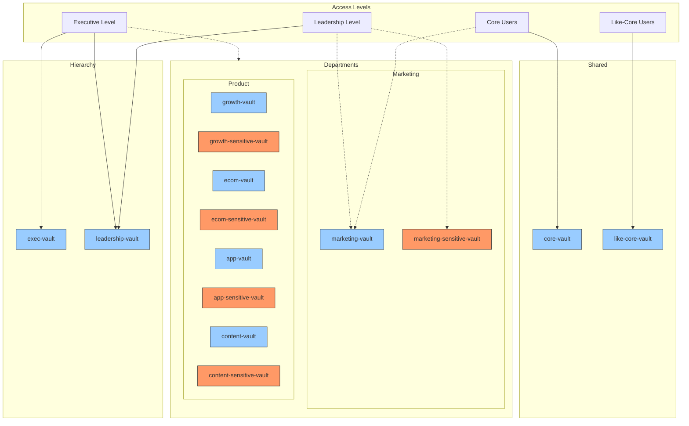

```mermaid

graph TD
    subgraph Hierarchy
        E[exec-vault]
        L[leadership-vault]
    end

    subgraph Shared
        C[core-vault]
        LC[like-core-vault]
    end

    subgraph Departments
        subgraph Marketing
            M[marketing-vault]
            MS[marketing-sensitive-vault]
        end

        subgraph Product
            P1[growth-vault]
            PS1[growth-sensitive-vault]
            P2[ecom-vault]
            PS2[ecom-sensitive-vault]
            P3[app-vault]
            PS3[app-sensitive-vault]
            P4[content-vault]
            PS4[content-sensitive-vault]
        end
        %% Other departments similar structure
    end

    subgraph Access Levels
        Exec[Executive Level]
        Lead[Leadership Level]
        CoreU[Core Users]
        LikeC[Like-Core Users]
    end

    Exec --> E
    Exec --> L
    Exec -.-> Departments
    Lead --> L
    Lead -.-> M & MS
    CoreU --> C
    CoreU -.-> M
    LikeC --> LC

    classDef sensitive fill:#f96,stroke:#333
    classDef standard fill:#9cf,stroke:#333
    class MS,PS1,PS2,PS3,PS4 sensitive
    class M,P1,P2,P3,P4,C,LC,E,L standard

```
