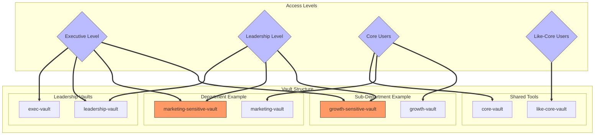

```mermaid

graph TD
    subgraph Access Levels
        Exec{Executive Level}
        Lead{Leadership Level}
        CoreU{Core Users}
        LikeC{Like-Core Users}
    end

    subgraph Vault Structure
        subgraph Leadership Vaults
            E[exec-vault]
            L[leadership-vault]
        end

        subgraph Shared Tools
            C[core-vault]
            LC[like-core-vault]
        end

        subgraph Department Example
            M[marketing-vault]
            MS[marketing-sensitive-vault]
            style MS fill:#f96,stroke:#333
        end

        subgraph Sub-Department Example
            P1[growth-vault]
            PS1[growth-sensitive-vault]
            style PS1 fill:#f96,stroke:#333
        end
    end

    Exec ==> E
    Exec ==> L
    Exec ==> MS
    Exec ==> PS1
    Lead ==> L
    Lead ==> MS
    Lead ==> PS1
    CoreU ==> C
    CoreU ==> M
    CoreU ==> P1
    LikeC ==> LC

    classDef access fill:#bbf,stroke:#333
    class Exec,Lead,CoreU,LikeC access

```
