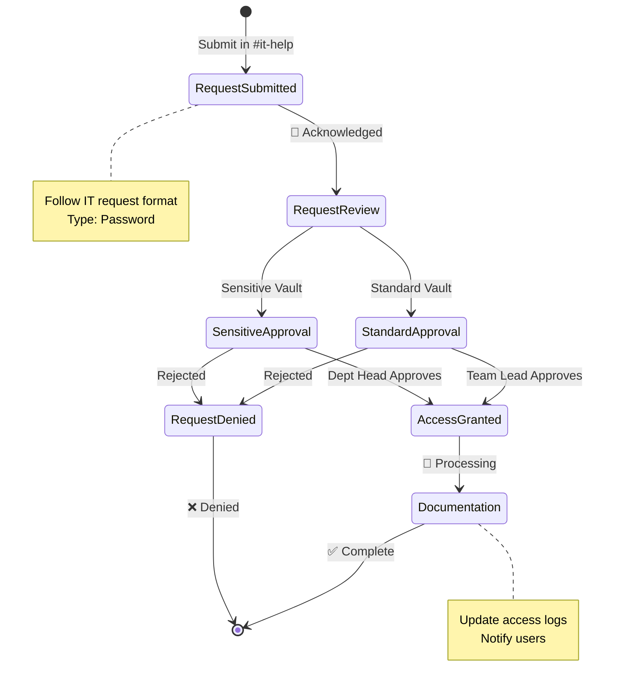

```mermaid

stateDiagram-v2
    [*] --> RequestSubmitted: Submit in #it-help
    
    RequestSubmitted --> RequestReview: 👀 Acknowledged
    note right of RequestSubmitted
        Follow IT request format
        Type: Password
    end note
    
    RequestReview --> StandardApproval: Standard Vault
    RequestReview --> SensitiveApproval: Sensitive Vault
    
    StandardApproval --> AccessGranted: Team Lead Approves
    SensitiveApproval --> AccessGranted: Dept Head Approves
    
    AccessGranted --> Documentation: 🔐 Processing
    
    Documentation --> [*]: ✅ Complete
    note right of Documentation
        Update access logs
        Notify users
    end note
    
    StandardApproval --> RequestDenied: Rejected
    SensitiveApproval --> RequestDenied: Rejected
    RequestDenied --> [*]: ❌ Denied

```
