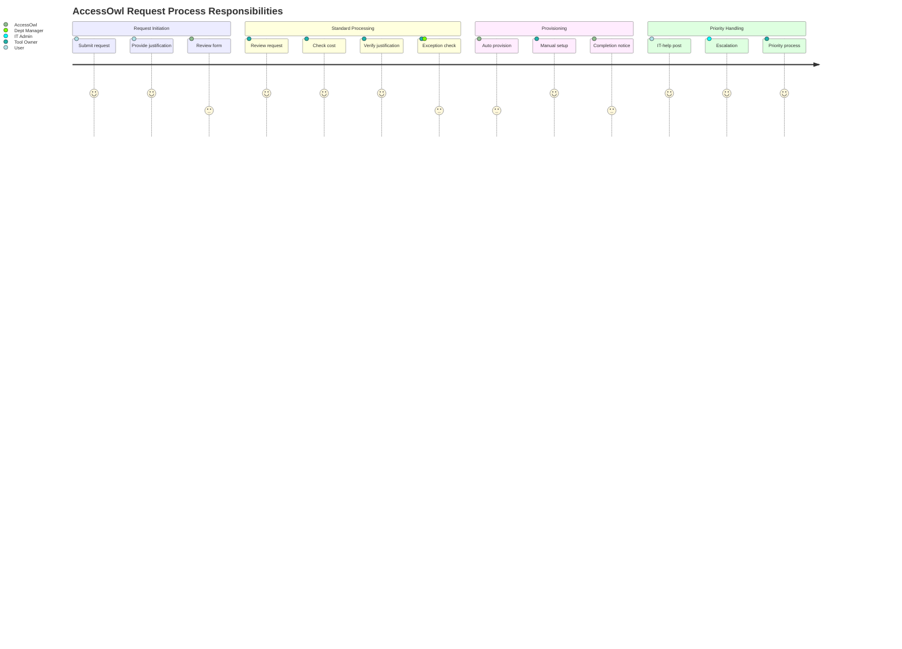

```mermaid

journey
    title AccessOwl Request Process Responsibilities
    section Request Initiation
      Submit request: 5: User
      Provide justification: 5: User
      Review form: 3: AccessOwl
    section Standard Processing
      Review request: 5: Tool Owner
      Check cost: 5: Tool Owner
      Verify justification: 5: Tool Owner
      Exception check: 3: Tool Owner, Dept Manager
    section Provisioning
      Auto provision: 3: AccessOwl
      Manual setup: 5: Tool Owner
      Completion notice: 3: AccessOwl
    section Priority Handling
      IT-help post: 5: User
      Escalation: 5: IT Admin
      Priority process: 5: Tool Owner

```
