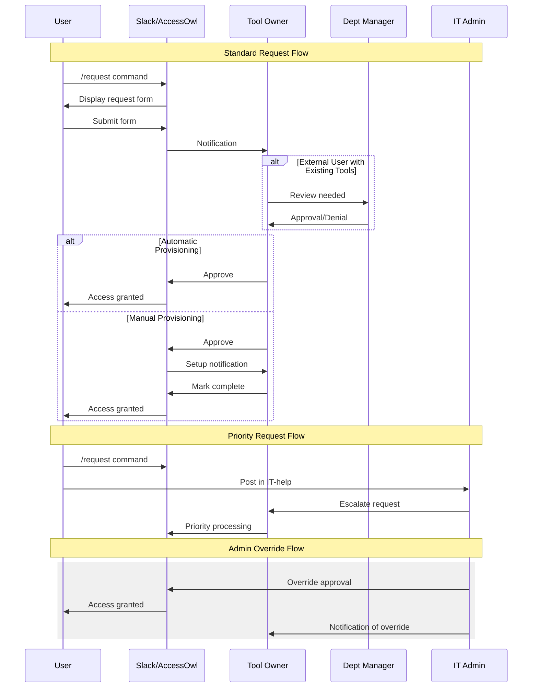

```mermaid

sequenceDiagram
    participant User
    participant Slack/AccessOwl
    participant Tool Owner
    participant Dept Manager
    participant IT Admin

    %% Standard Request Flow
    Note over User,IT Admin: Standard Request Flow
    User->>Slack/AccessOwl: /request command
    Slack/AccessOwl->>User: Display request form
    User->>Slack/AccessOwl: Submit form
    Slack/AccessOwl->>Tool Owner: Notification
    
    alt External User with Existing Tools
        Tool Owner->>Dept Manager: Review needed
        Dept Manager->>Tool Owner: Approval/Denial
    end

    alt Automatic Provisioning
        Tool Owner->>Slack/AccessOwl: Approve
        Slack/AccessOwl->>User: Access granted
    else Manual Provisioning
        Tool Owner->>Slack/AccessOwl: Approve
        Slack/AccessOwl->>Tool Owner: Setup notification
        Tool Owner->>Slack/AccessOwl: Mark complete
        Slack/AccessOwl->>User: Access granted
    end

    %% Priority Request Flow
    Note over User,IT Admin: Priority Request Flow
    User->>Slack/AccessOwl: /request command
    User->>IT Admin: Post in IT-help
    IT Admin->>Tool Owner: Escalate request
    Tool Owner->>Slack/AccessOwl: Priority processing

    %% Admin Override Flow
    Note over User,IT Admin: Admin Override Flow
    rect rgb(240, 240, 240)
        IT Admin->>Slack/AccessOwl: Override approval
        Slack/AccessOwl->>User: Access granted
        IT Admin->>Tool Owner: Notification of override
    end

```
