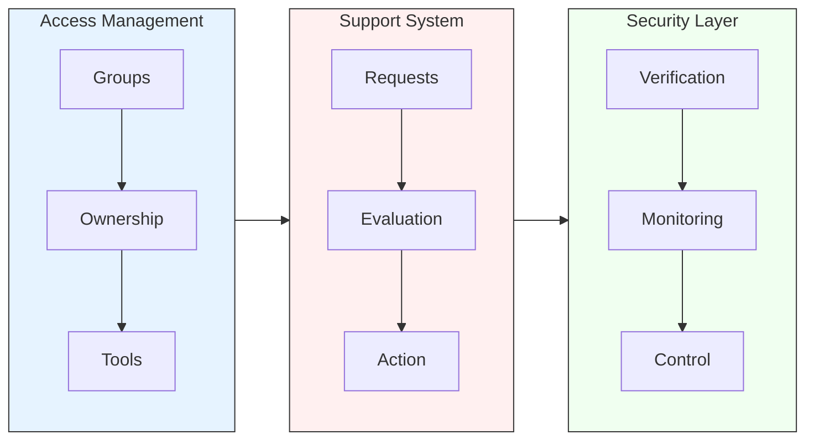

```mermaid

flowchart LR
    subgraph Access["Access Management"]
        G[Groups] --> O[Ownership]
        O --> T[Tools]
    end

    subgraph Support["Support System"]
        R[Requests] --> E[Evaluation]
        E --> A[Action]
    end

    subgraph Security["Security Layer"]
        V[Verification] --> M[Monitoring]
        M --> C[Control]
    end

    Access --> Support
    Support --> Security

    style Access fill:#e6f3ff,stroke:#333
    style Support fill:#fff0f0,stroke:#333
    style Security fill:#f0fff0,stroke:#333

```
